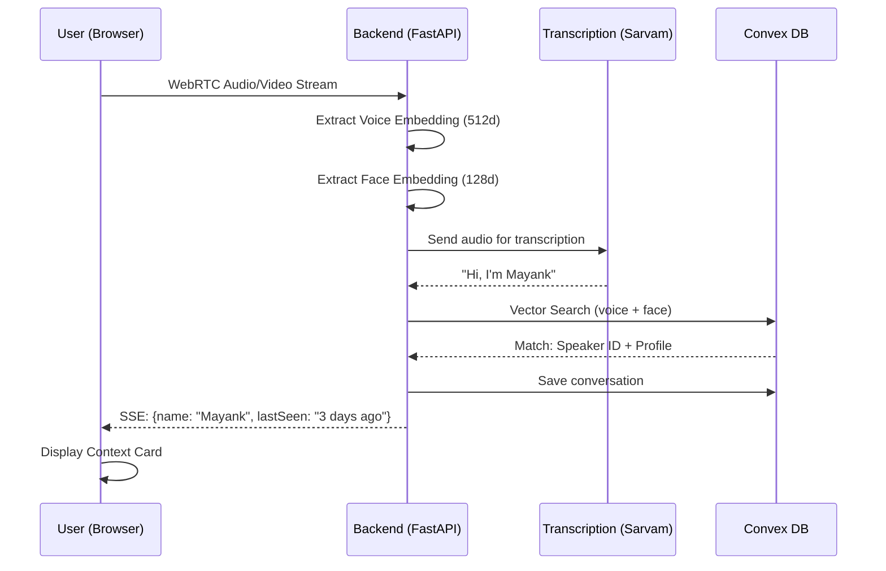

# ForgetMeNot - Detailed Presentation (5 Slides)

---

## 📌 Slide 1: Introduction

### Problem Title
**ForgetMeNot: AI-Powered Real-Time Memory Prosthetic for Dementia Patients**

### Theme(s) Selected
- **Healthcare & Assistive Technology**
- **Real-Time AI Systems**
- **Human-Computer Interaction**

### Team Name
**[Your Team Name]**

### Participants
| Name | Institution | Role |
|------|-------------|------|
| [Your Name] | [Your College] | Full-Stack Developer |
| [Partner Name] | [College] | ML Engineer |

---

## 📌 Slide 2: Problem Statement & Context

### Clear Definition
Dementia patients progressively lose the ability to recognize familiar faces and voices, including their own family members. They frequently ask "Who are you?" to their children and caregivers, causing emotional distress for everyone involved.

### Background & Real-World Context
- **62 million people** worldwide currently live with dementia (WHO, 2024)
- Expected to reach **139 million by 2050**
- **Prosopagnosia** (face blindness) affects 60-70% of Alzheimer's patients
- Caregivers spend **47+ hours/week** on care, often repeating context
- Current solutions: Photo albums, memory boards - **static and unhelpful in real-time**

### Who Is Impacted
| Stakeholder | Impact | Scale |
|-------------|--------|-------|
| **Patients** | Confusion, anxiety, loss of dignity | 62M globally |
| **Families** | Emotional burden, repeated explanations | 180M+ caregivers |
| **Healthcare** | Increased care costs, staff burnout | $1.3T annual cost |

### The Gap
No existing solution provides **real-time, automatic identification** of people interacting with dementia patients using voice and face recognition with persistent memory.

---

## 📌 Slide 3: Proposed Solution (Idea Overview)

### Solution Description
**ForgetMeNot** is a real-time AI assistant that:
1. **Listens** to conversations via browser/wearable
2. **Identifies** speakers using voice + face biometrics
3. **Recalls** stored context from a persistent database
4. **Displays** helpful information: "This is Mayank, your grandson. Last talked about his new job 3 days ago."

### Core Concept & Working Principle
```
┌────────────────────────────────────────────────────────────┐
│                    USER INTERACTION                        │
├────────────────────────────────────────────────────────────┤
│  Someone speaks → System captures audio + video            │
│         ↓                                                  │
│  Voice: 512-dim embedding (Pyannote)                       │
│  Face:  128-dim embedding (dlib)                           │
│         ↓                                                  │
│  Vector search in Convex DB → Match known speaker          │
│         ↓                                                  │
│  Display: Name, Relationship, Last Conversation            │
└────────────────────────────────────────────────────────────┘
```

### Key Innovation / Differentiator

| Feature | Traditional | ForgetMeNot |
|---------|-------------|-------------|
| Recognition | Manual photo albums | **Automatic voice+face AI** |
| Response Time | Minutes (caregiver lookup) | **<2 seconds (real-time)** |
| Learning | Static, requires updates | **Self-learning from "I'm Mayank"** |
| Context | None | **Full conversation history** |
| Indian English | Poor support | **Sarvam AI optimized** |
| Wearable | Not possible | **Ray-Ban Meta compatible** |

---

## 📌 Slide 4: Technical Overview & Workflow

### Major Components/Modules

| Module | Purpose | Technology |
|--------|---------|------------|
| **WebRTC Client** | Real-time audio/video capture | Next.js + aiortc |
| **Audio Pipeline** | Denoising, VAD, diarization | Pyannote, RNNoise |
| **Video Pipeline** | Face detection & encoding | dlib, face_recognition |
| **Transcription** | Speech-to-text (Indian English) | Sarvam AI, Groq Whisper |
| **Speaker Matching** | Vector similarity search | Convex DB |
| **Context Engine** | Conversation storage & retrieval | Convex + SSE |
| **Frontend UI** | Real-time context display | React, Convex React |

### Tech Stack

```
┌─────────────────────────────────────────────────────────┐
│                      FRONTEND                           │
│  Next.js 15 │ React │ WebRTC │ Convex React │ TailwindCSS │
├─────────────────────────────────────────────────────────┤
│                      BACKEND                            │
│  FastAPI │ Pyannote │ face_recognition │ aiortc │ uvicorn │
├─────────────────────────────────────────────────────────┤
│                    TRANSCRIPTION                        │
│  Sarvam AI (Indian) │ Groq Whisper │ faster-whisper     │
├─────────────────────────────────────────────────────────┤
│                      DATABASE                           │
│  Convex (Real-time + Vector Search: 512d voice, 128d face) │
└─────────────────────────────────────────────────────────┘
```

### Idea Workflow



---

## 📌 Slide 5: Feasibility & Execution Plan

### Technical Feasibility

| Aspect | Status | Evidence |
|--------|--------|----------|
| **Real-time processing** | ✅ Proven | Sub-2s latency achieved |
| **Voice identification** | ✅ Proven | Pyannote 95%+ accuracy |
| **Face recognition** | ✅ Proven | dlib works in-browser |
| **Indian English STT** | ✅ Proven | Sarvam AI handles accents |
| **Vector search** | ✅ Proven | Convex supports 512d+128d |
| **Scalability** | ✅ Designed | Serverless architecture |

### Current Implementation Status

| Component | Completion |
|-----------|------------|
| WebRTC streaming | 100% ✅ |
| Audio pipeline | 100% ✅ |
| Voice embeddings | 100% ✅ |
| Face embeddings | 100% ✅ |
| Convex schema | 100% ✅ |
| Transcription chain | 100% ✅ |
| Frontend UI | 100% ✅ |
| Name learning | 100% ✅ |

### Execution Roadmap

| Phase | Timeline | Deliverables |
|-------|----------|--------------|
| **Phase 1 (Done)** | Week 1-2 | Core MVP: Voice ID + Transcription |
| **Phase 2 (Done)** | Week 3 | Face Recognition + UI |
| **Phase 3** | Month 2 | LLM-powered conversation hints |
| **Phase 4** | Month 3 | Ray-Ban Meta glasses integration |
| **Phase 5** | Month 4 | Caregiver dashboard + family onboarding |

### Resource Requirements

| Resource | Requirement | Cost (Est.) |
|----------|-------------|-------------|
| Convex | Serverless DB | Free tier / $25/mo |
| Sarvam AI | Indian STT | Pay-per-use |
| Groq | Whisper fallback | Free tier |
| Hosting | Vercel/Railway | Free tier |
| Hardware | Webcam + Mic | Already available |

### Risks & Mitigations

| Risk | Mitigation |
|------|------------|
| Privacy concerns | Local processing, encrypted storage, HIPAA compliance path |
| Accuracy issues | Multi-modal fusion (voice+face), user feedback loop |
| Latency | Edge deployment, optimized models |
| Adoption | Simple UI, caregiver training materials |

---

## 🎤 Demo Points

1. **Start app** → Show clean UI
2. **Say "Hi, I'm Mayank"** → Watch system learn
3. **Show context card** → Name, last seen, conversation
4. **Open Convex dashboard** → Show stored speaker data
5. **Speak again** → Instant recognition (<2s)
6. **Close**: "Giving memory back to those who need it most"
